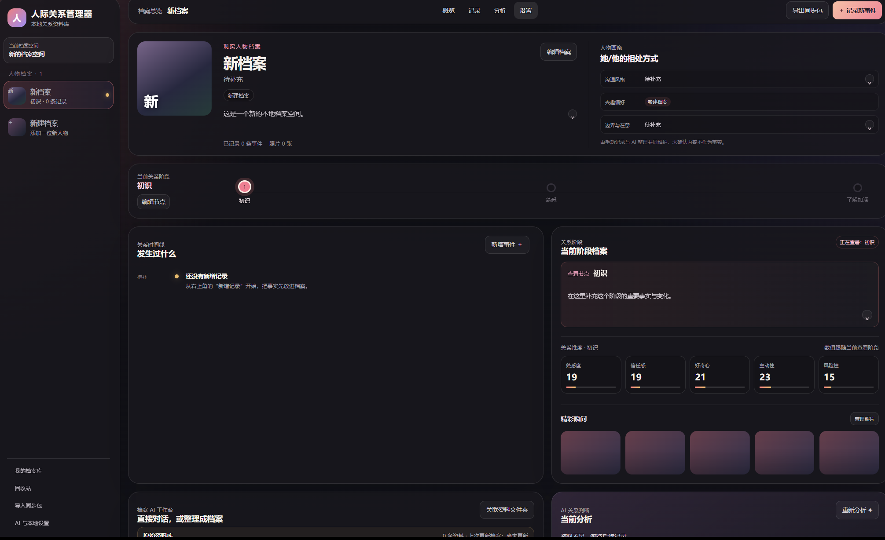
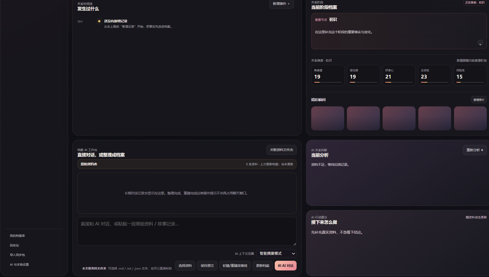

# 人际关系管理器

人际关系管理器是一个本地优先的关系记录与整理工具。它可以帮你为不同的人建立档案，记录日常互动，把零散事件整理成时间线、关系阶段、关系维度和可读档案。

它最早并不是一个严肃项目。一开始，是我一个女性朋友跟我吐槽：

> 好烦啊，鱼塘太多了，管理不过来，怎么办啊。
>
> 要是能像游戏一样，每个人物建立一个档案，还有属性点数，最好还有攻略，能告诉我下一步该干嘛就好了。

我当时跟她说：你坚持跟 AI 对话，让 AI 帮你记日记、做整理、提建议不就行了吗。

她说不行，太麻烦了，除非市面上有一个现成的软件。

于是我为了帮她这个忙，先手搓了一个“鱼塘管理器”。做着做着，我发现它其实不只适合用来管理暧昧关系，也可以更通用地记录你和每一个人之间发生过的事情：有仇的记仇，有恩的记恩，朋友、对象、亲人、同事、合作伙伴都可以记录，甚至也可以记录你和宠物之间的日常互动。

所以它最终变成了现在这个名字：**人际关系管理器**。

这个项目不鼓励操控关系，也不是情感裁判。它更像一个本地笔记本：帮你把发生过的事情留好，把事实、感受、判断和 AI 的整理放在一个更清楚的位置。

## 界面预览

<p align="center">
  
</p>

<p align="center">
  
</p>

## 主要功能

- **人物档案**：为不同对象建立独立档案，记录头像、名称、标签、简介、人物画像和相处方式。
- **关系时间线**：把一次次互动记录成事件，按日期排列，方便回看发生过什么。
- **关系阶段**：把关系变化整理成阶段节点，例如初识、熟悉、稳定、疏远、归档等。
- **关系维度**：用熟悉度、信任感、好奇心、主动性、风险性等指标辅助观察当前状态。
- **AI 工作台**：可以粘贴原始资料、故事线或聊天内容，让 AI 帮你整理档案、重建时间线、更新关系分析。
- **AI 对话记录**：可以直接和 AI 聊当前关系，聊天内容会进入本地记录。
- **本地自动保存**：关联本地文件夹后，会自动生成 JSON 数据和可读 Markdown 档案。
- **导出同步包**：可以导出当前数据，方便备份或迁移。

## 快速开始

Windows 下双击：

```text
启动人际关系管理器.bat
```

默认会在本地打开：

```text
http://127.0.0.1:4177/
```

建议使用 Chrome 或 Edge。首次运行前，电脑需要安装 Node.js。

也可以用命令启动：

```bash
npm install
npm run start
```

开发模式：

```bash
npm run dev
```

生成静态发布文件和离线 HTML：

```bash
npm run release
```

## 推荐使用流程

下面用“记录和对象的日常”为例，简单说明用法。

### 1. 配置本地保存和 AI

拿到软件之后，建议先进入设置页，选择一个固定的本地文件夹。之后软件会把你的档案、事件、聊天记录和可读 Markdown 自动保存到这个文件夹里。

如果你要使用 AI 功能，也需要在设置里配置自己的 AI API。目前我主要基于 DeepSeek 测试。一般来说，模型能力越强，整理效果越好。

### 2. 建立人物档案

先新建一个人物档案，可以上传头像，填写名称、标签、简介、相处方式等信息。

头像上传后，会保存在本地数据里，不会自动发送给 AI。

### 3. 记录发生过的事情

在“关系时间线 / 发生过什么”里，可以记录你和这个人物发生的一些事情。

你可以：

- 点击“新增事件”，一条一条手动添加；
- 把你和这个人发生过的事情写成文档，再上传给 AI；
- 把完整故事线粘贴进 AI 工作台，让 AI 帮你一次性整理。

例如，可以选择 `examples/虚构测试故事线.md` 里的测试材料，然后点击“初建/重建故事线”。AI 会尝试把故事自动整理成不同时间节点，并同步更新关系时间线和关系阶段。

### 4. 更新档案和查看分析

当你补充了新资料，可以点击“更新档案”，让 AI 根据当前资料重新整理人物档案、关系阶段、关系维度和下一步建议。

关系时间线、关系阶段、当前分析和行动建议会尽量保持同步。

### 5. 直接和 AI 对话

如果你有什么不会的、不懂的、想问的，也可以在 AI 工作台里直接和 AI 对话。

只要你关联了本地资料文件夹，聊天记录也会保存到本地 Markdown 中，方便之后回看。

## 本地保存说明

默认情况下，数据会先保存在当前浏览器本地。不同浏览器、不同端口可能看到不同的数据。

如果你希望长期使用，请进入：

```text
AI 与本地设置 -> 数据管理 -> 关联/更换本地数据文件夹
```

关联后，软件会在你选择的文件夹中保存数据，包括：

- 完整 JSON 数据镜像；
- 自动备份快照；
- 每个人物的可读 Markdown 档案；
- 原始资料记录；
- AI 对话记录。

更详细说明见：

```text
docs/本地自动保存说明.md
```

## 隐私和 AI

- 不填写 API Key 时，AI 功能不会真正请求远程模型。
- API Key 只保存在当前浏览器本地，不会写入同步包和本地数据镜像。
- 点击 AI 功能时，软件才会把相关文字发送给你配置的模型接口。
- 上传照片会压缩后保存在本地数据里，不会自动发送给 AI。
- GitHub 发布版不包含真实用户资料、聊天记录、API Key 或本地备份数据。

请不要用这个工具去骚扰、操控、跟踪别人，也不要尝试绕过模型或平台的安全限制。它的目标是帮助你更清楚地记录和理解关系，而不是替你做不负责任的决定。

## 示例材料

仓库里提供了虚构测试材料，方便你试用：

```text
examples/虚构测试故事线.md
examples/虚构测试头像.png
```

这些材料不会被程序自动读取，也没有写死在代码里。需要测试时，请在软件中手动选择或粘贴。

## 当前状态

这是我第一次做软件，目前肯定还有不少 bug，也有很多地方不够完善。

能用就先凑合着用。有动手能力的话，也欢迎自己修改、提交 issue 或继续二次开发。

## 项目地址

```text
https://github.com/Black-0621/relationship-manager
```

## License

MIT License
